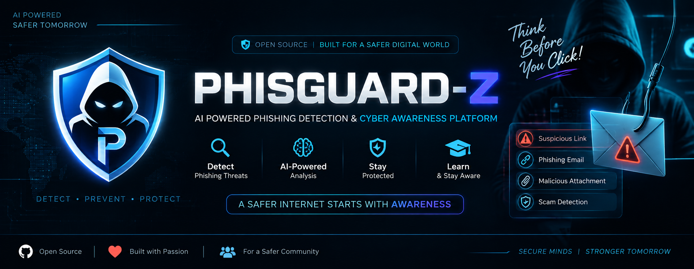

# 🛡️ PHISGUARD-Z

<p align="center">
  
</p>

<p align="center">
  <a href="https://phisguard-z.onrender.com/">
    
  </a>
  <a href="https://github.com/TECH-SUGATA/phisguard-z">
    
  </a>
</p>

<p align="center">
  <strong>Autonomous Zero-Day &amp; Phishing Interceptor</strong>
</p>

<p align="center">
  AI-powered phishing detection, URL intelligence, zero-day analysis, threat intelligence, and SOC-oriented security response.
</p>

---

## 🚀 Live Project

| Resource | Link |
|---|---|
| 🌐 **Live Application** | [https://phisguard-z.onrender.com/](https://phisguard-z.onrender.com/) |
| 💻 **GitHub Repository** | [https://github.com/TECH-SUGATA/phisguard-z](https://github.com/TECH-SUGATA/phisguard-z) |

---

# 🔥 Product Overview

PHISGUARD-Z presents a unified security workspace for investigating suspicious URLs, phishing activity, email threats, zero-day-style anomalies, obfuscated payloads, and learned threat patterns.

The live interface is organized around security operations modules such as:

- Dashboard
- Email & BEC
- Zero-Day Sandbox
- Popup Protection
- Simulator
- Learner
- Vault
- URL Inspection
- Audit Reports
- Security Telemetry
- Threat Learning
- Forensic Investigation

The application uses a security-first workflow:

```text
                    ┌──────────────────────────┐
                    │   URL / Email / Payload  │
                    └─────────────┬────────────┘
                                  │
                                  ▼
                    ┌──────────────────────────┐
                    │  Security Heuristics     │
                    │  & Indicator Analysis    │
                    └─────────────┬────────────┘
                                  │
                 ┌────────────────┼────────────────┐
                 ▼                ▼                ▼
          URL Intelligence   Phishing/BEC     Zero-Day /
          & Domain Signals     Analysis      Payload Analysis
                 │                │                │
                 └────────────────┼────────────────┘
                                  ▼
                    ┌──────────────────────────┐
                    │  AI-Assisted Analysis    │
                    │   & Threat Correlation   │
                    └─────────────┬────────────┘
                                  │
                                  ▼
                    ┌──────────────────────────┐
                    │ Risk / Threat Assessment │
                    └─────────────┬────────────┘
                                  │
                  ┌───────────────┼────────────────┐
                  ▼               ▼                ▼
             Quarantine      Learn Pattern     SOC Response
```

---

# ✨ Platform Highlights

## 📊 Security Operations Dashboard

The main dashboard provides a high-level security view with live-style telemetry cards for:

| Metric | Purpose |
|---|---|
| 🌐 **Links Inspected** | Tracks inspected web links |
| 🛡️ **Threats Neutralized** | Displays intercepted threat activity |
| ⚡ **Zero-Day Attacks** | Highlights detected zero-day-style anomalies |
| 🧠 **Learned Patterns** | Shows stored/adaptive threat patterns |

The interface also exposes the current analysis-engine state and operational controls from the dashboard.

---

# 🔗 Deep Link & Zero-Day Neural Inspection Lab

The central inspection workspace allows analysts to paste a URL or suspicious hyperlink for deeper inspection.

The interface provides a dedicated scan workflow around:

- Suspicious URL inspection
- Shannon entropy-oriented analysis
- Punycode decoding
- Homoglyph-oriented investigation
- Zero-day anomaly analysis
- AI-assisted forensic analysis
- Threat classification
- Security response actions

Example input:

```text
https://example.com/login
```

Example flow:

```text
Paste URL
    ↓
Execute Deep Scan
    ↓
Normalize & Inspect
    ↓
Analyze Domain / URL Signals
    ↓
Check Entropy / Encoding / Spoofing
    ↓
AI-Assisted Threat Analysis
    ↓
Risk & Threat Assessment
    ↓
Quarantine / Learn / Forensic Review
```

---

# 🧪 Security Test Presets

The interface provides quick test presets for common security-analysis scenarios, including:

```text
Microsoft (Zero-Day)
PayPal (Homograph)
Chase (Credential)
MetaMask (Zero-Day)
DocuSign (OAuth)
```

These presets are intended to make security-analysis workflows easier to demonstrate and test.

---

# 🚨 Threat Detection Result

The dashboard presents detailed threat cards for suspicious findings.

A visible example includes:

```text
CRITICAL ZERO-DAY
Engine: zero_day_neural_net

Credential Harvester
```

The interface exposes response actions such as:

```text
┌───────────────┐
│  Quarantine   │
└───────────────┘

┌───────────────┐
│ Learn Pattern │
└───────────────┘

┌────────────────┐
│ Forensic Modal │
└────────────────┘
```

---

# 📈 Threat & Risk Telemetry

The inspection result presents security-oriented indicators such as:

```text
Total Risk Score
Zero-Day Anomaly
Domain Entropy
Punycode / Homoglyph Indicators
```

Example dashboard-style values shown by the application can include:

```text
Risk Score        → 98 / 100
Zero-Day Anomaly  → 92%
Domain Entropy    → 4.055 bits
```

These displayed values are part of the application's current threat-analysis interface and should be interpreted as analysis signals rather than definitive proof of malicious activity.

---

# 🧠 AI Security Engine

The current interface displays an active Gemini-powered analysis engine for deeper threat investigation.

```text
┌────────────────────────────────────────────┐
│ Gemini Neural Engine                       │
│ AI-assisted deep threat analysis           │
└────────────────────────────────────────────┘
```

The AI layer complements deterministic security heuristics by helping classify suspicious patterns and organize investigation results.

---

# 📧 Email & BEC

The **Email & BEC** module provides a dedicated workspace for investigating suspicious email activity and business-email-compromise style threats.

The security workflow can be used to evaluate:

- Suspicious messages
- Social-engineering signals
- Credential-harvesting indicators
- Suspicious links
- Urgency/manipulation patterns
- Threat severity
- Recommended response actions

---

# 🧪 Zero-Day Sandbox

The **Zero-Day Sandbox** area is designed for deeper investigation of suspicious payload and anomalous behavior.

The platform exposes workflows for:

- Novel payload indicators
- Obfuscation analysis
- Suspicious execution patterns
- Anti-analysis signals
- Forensic investigation
- Threat-pattern learning

---

# 🛡️ Popup Protection

The **Popup** module supports browser-style protection workflows for detecting and blocking suspicious activity.

The visible interface includes threat-blocking notifications such as:

```text
PHISGUARD EXTENSION
THREAT BLOCKED
```

This provides a user-facing security feedback mechanism when a suspicious event is intercepted.

---

# 🌐 URL Inspection

The **Inspect URL** workflow provides direct access to suspicious-link investigation.

A typical analysis pipeline is:

```text
URL
 ↓
URL Normalization
 ↓
Hostname / Domain Analysis
 ↓
Lexical Inspection
 ↓
Spoofing / Homoglyph Checks
 ↓
Punycode Analysis
 ↓
Entropy Analysis
 ↓
Threat Scoring
 ↓
AI-Assisted Analysis
 ↓
Security Decision Support
```

---

# 📑 Audit Reports

The **Audit Report** feature provides a dedicated place for reviewing security-analysis findings and investigation results.

A report can be used to organize:

- Target URL
- Threat category
- Risk indicators
- Analysis findings
- Recommended response
- Investigation context

---

# 🧠 Learner

The **Learner** module is designed around adaptive threat-pattern learning.

```text
New Observation
      ↓
Threat Analysis
      ↓
Indicator Extraction
      ↓
Pattern Generation
      ↓
Pattern Learning
      ↓
Future Analysis
```

This allows the platform to build reusable security intelligence from observed patterns.

---

# 🔐 Vault

The **Vault** area provides a dedicated location for security-related information and protected investigation context.

It is designed as part of the wider security-operations workflow.

---

# 🎮 Simulator

The **Simulator** module provides a controlled interface for demonstrating security scenarios and investigation workflows.

It can be used to showcase:

- Threat scenarios
- Detection flows
- Analysis behavior
- Response workflows
- Security demonstrations

---

# 🧬 Forensic Investigation

PHISGUARD-Z includes a forensic-oriented workflow for deeper inspection of suspicious findings.

The inspection result can expose evidence such as:

- Threat classification
- Risk score
- Zero-day anomaly level
- Domain entropy
- Punycode / homoglyph indicators
- Engine classification
- Threat URL
- Response controls

---

# 🧠 Security Analysis Architecture

```text
┌─────────────────────────────────────────────────────────┐
│                     PHISGUARD-Z                         │
│        Autonomous Zero-Day & Phishing Interceptor       │
└──────────────────────────┬──────────────────────────────┘
                           │
          ┌────────────────┼────────────────┐
          │                │                │
          ▼                ▼                ▼
   ┌──────────────┐ ┌───────────────┐ ┌───────────────┐
   │ URL Security │ │ Email & BEC   │ │ Zero-Day      │
   │ Inspection   │ │ Analysis      │ │ Sandbox       │
   └──────┬───────┘ └──────┬────────┘ └──────┬────────┘
          │                │                 │
          └────────────────┼─────────────────┘
                           │
                           ▼
                ┌──────────────────────┐
                │ Security Heuristics  │
                └──────────┬───────────┘
                           │
                           ▼
                ┌──────────────────────┐
                │ AI-Assisted Analysis │
                └──────────┬───────────┘
                           │
                           ▼
                ┌──────────────────────┐
                │ Threat Correlation   │
                │ & Risk Assessment    │
                └──────────┬───────────┘
                           │
          ┌────────────────┼────────────────┐
          ▼                ▼                ▼
     Quarantine       Learn Pattern    Forensic Review
          │                │                │
          └────────────────┼────────────────┘
                           ▼
                  ┌──────────────────┐
                  │ SOC Response     │
                  └──────────────────┘
```

---

# 🛠️ Technology Stack

## Frontend

- React
- Vite
- TypeScript
- Tailwind CSS
- Lucide React
- Motion
- D3

## Backend

- Node.js
- Express
- TypeScript
- TSX
- esbuild
- dotenv

## AI

- Google Gemini
- `@google/genai`

## Security Analysis

- URL/domain heuristics
- Punycode analysis
- Homoglyph detection
- Entropy analysis
- Lexical anomaly analysis
- Obfuscation checks
- Threat scoring
- Threat-pattern learning
- SOC-style response workflows

## Deployment

- GitHub
- Render

---

# 📂 Project Structure

```text
PHISGUARD-Z/
│
├── src/
│   └── React frontend
│
├── server.ts
│   └── Express + AI/security backend
│
├── index.html
├── package.json
├── vite.config.ts
├── tsconfig.json
├── metadata.json
├── .env.example
├── .gitignore
├── bun.lock
└── README.md
```

---

# ⚙️ Local Setup

## 1. Clone

```bash
git clone https://github.com/TECH-SUGATA/phisguard-z.git
cd phisguard-z
```

## 2. Install Dependencies

```bash
npm install
```

## 3. Configure Environment Variables

Create a local `.env` file:

```env
GEMINI_API_KEY=your_gemini_api_key
```

> ⚠️ Never commit real API credentials to GitHub.

## 4. Start Development Server

```bash
npm run dev
```

---

# 🏗️ Production Build

```bash
npm run build
```

Then:

```bash
npm start
```

---

# 🔌 API Surface

| Method | Endpoint | Purpose |
|---|---|---|
| `GET` | `/api/health` | Service health |
| `GET` | `/api/threat-intel` | Threat intelligence |
| `GET` | `/api/threat-intel/sync` | Threat-pattern synchronization |
| `POST` | `/api/background-scan/batch` | Batch URL analysis |
| `POST` | `/api/scan` | URL inspection |
| `POST` | `/api/learn-pattern` | Learn/store threat pattern |
| `POST` | `/api/scan-email` | Email / BEC analysis |
| `POST` | `/api/dispatch-soc-alert` | SOC alert workflow |
| `POST` | `/api/detonate-payload` | Payload / obfuscation inspection |

---

# 🧪 Example API Request

```http
POST /api/scan
Content-Type: application/json
```

```json
{
  "url": "https://example.com/login",
  "fastMode": false
}
```

---

# ☁️ Deployment

## Render

Live production deployment:

### 🌐 https://phisguard-z.onrender.com/

Typical build command:

```text
npm install && npm run build
```

Typical start command:

```text
npm start
```

Configure secrets such as:

```text
GEMINI_API_KEY=your_gemini_api_key
```

inside the Render environment configuration.

---

# 🔄 Development & Deployment Workflow

```text
┌──────────────────────────────┐
│ Google AI Studio / Local Dev │
└──────────────┬───────────────┘
               │
               ▼
       ┌───────────────┐
       │    GitHub     │
       │ PHISGUARD-Z   │
       └───────┬───────┘
               │
               ▼
       ┌───────────────┐
       │    Render     │
       │  Deployment   │
       └───────┬───────┘
               │
               ▼
       ┌────────────────────┐
       │ PHISGUARD-Z LIVE   │
       └────────────────────┘
```

---

# 🔐 Security Considerations

PHISGUARD-Z is intended as a **defensive cybersecurity research and analysis platform**.

Important deployment practices:

- Keep API keys outside source control.
- Validate and sanitize untrusted input.
- Do not execute unknown payloads directly on production infrastructure.
- Treat AI output as analysis signals.
- Validate critical findings independently.
- Add authentication before exposing sensitive APIs.
- Add authorization and role-based access control.
- Add rate limiting and abuse protection.
- Add persistent audit logs.
- Use isolated infrastructure for dynamic payload analysis.
- Add production monitoring and observability.

---

# 📈 Roadmap

- [ ] Persistent threat database
- [ ] User authentication
- [ ] Role-based access control
- [ ] Rate limiting
- [ ] Threat-intelligence integrations
- [ ] Domain reputation integrations
- [ ] Real-time notifications
- [ ] SOC incident management
- [ ] Container-isolated dynamic sandbox
- [ ] Historical threat analytics
- [ ] Case management
- [ ] Security audit logging
- [ ] CI/CD security checks
- [ ] Advanced threat visualization
- [ ] Enterprise deployment support

---

# 📊 Platform Capability Matrix

| Capability | Status |
|---|---|
| Dashboard | ✅ |
| URL Inspection | ✅ |
| Email & BEC | ✅ |
| Zero-Day Sandbox | ✅ |
| Popup Protection | ✅ |
| Simulator | ✅ |
| Learner | ✅ |
| Vault | ✅ |
| Audit Reports | ✅ |
| Threat Scoring | ✅ |
| Domain Entropy | ✅ |
| Punycode / Homoglyph Analysis | ✅ |
| AI-Assisted Analysis | ✅ |
| Threat Pattern Learning | ✅ |
| Quarantine Workflow | ✅ |
| Forensic Investigation | ✅ |
| Persistent Database | 🚧 |
| Authentication | 🚧 |
| Enterprise Dynamic Sandbox | 🚧 |

---

# 🎯 Security Workflow

```text
INSPECT
   ↓
ANALYZE
   ↓
CLASSIFY
   ↓
INVESTIGATE
   ↓
CONTAIN
   ↓
LEARN
```

### Core Principle

> **Detect → Analyze → Investigate → Contain → Learn**

---

# 👨‍💻 Author

## Sugata Nayak

**Computer Science & Engineering — Artificial Intelligence**

### GitHub

[https://github.com/TECH-SUGATA](https://github.com/TECH-SUGATA)

### Repository

[https://github.com/TECH-SUGATA/phisguard-z](https://github.com/TECH-SUGATA/phisguard-z)

---

# 🌐 Project Links

### 🚀 Live Demo

[https://phisguard-z.onrender.com/](https://phisguard-z.onrender.com/)

### 💻 GitHub Repository

[https://github.com/TECH-SUGATA/phisguard-z](https://github.com/TECH-SUGATA/phisguard-z)

---

# 📄 License

No license file is currently included in the repository.

Add an explicit open-source license before distributing the project under standard open-source terms.

---

# ⭐ Support

If you find **PHISGUARD-Z** useful for:

- Cybersecurity research
- AI experimentation
- Security education
- Phishing analysis
- Threat detection
- Portfolio development
- Hackathon demonstrations

consider giving the repository a ⭐ on GitHub.

---

<p align="center">

### 🛡️ PHISGUARD-Z

<strong>Detect. Analyze. Investigate. Contain. Learn.</strong>

<br />

AI-Powered Phishing & Zero-Day Threat Analysis Platform

</p>
